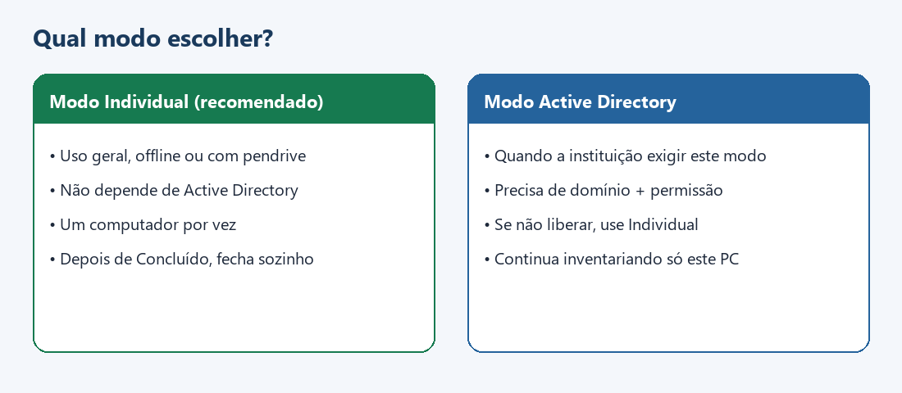
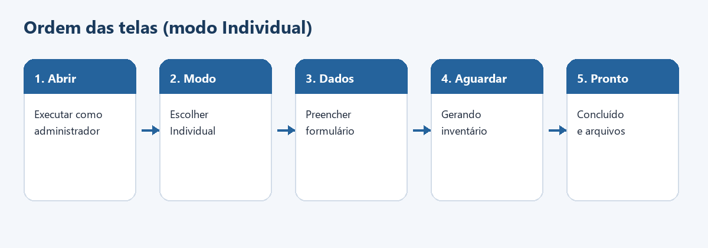
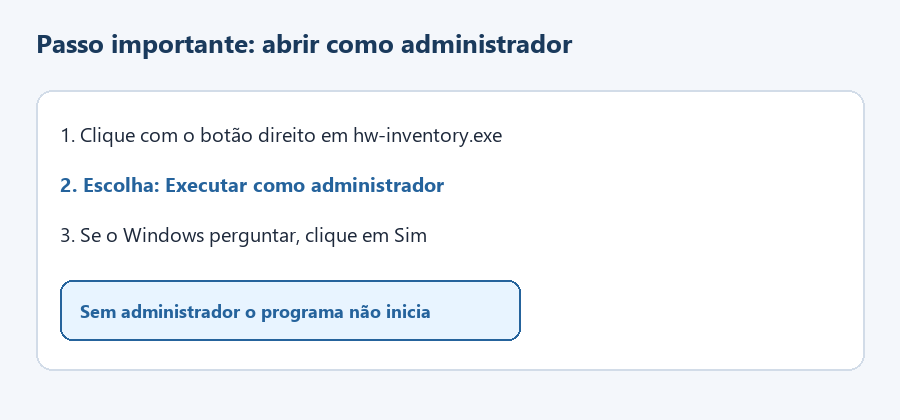
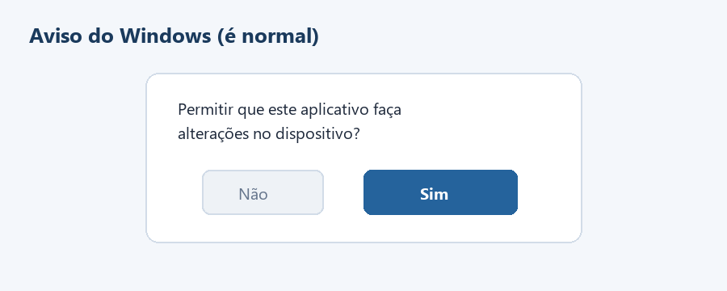

# Manual de utilização — Inventário patrimonial de hardware

**Versão do programa:** 0.3.5  
**Público:** qualquer pessoa que vá inventariar um computador — **não é necessário saber programar**.  
**Pacote típico (Windows):** este manual + `hw-inventory.exe` (pendrive, rede local ou cópia no PC).

---

## Objetivo do programa

O **hw-inventory** serve para **documentar o hardware de um computador** e associá-lo aos **dados patrimoniais** informados por quem executa o inventário (número de patrimônio, responsável, local etc.).

Em cada execução, o programa:

1. Coleta automaticamente as informações de hardware que o sistema operacional disponibiliza.  
2. Combina esses dados com o que você preencher no formulário.  
3. Gera, na Área de Trabalho, na pasta **`Inventario_Patrimonial`**:
   - planilha Excel (`.xlsx`)
   - relatório em PDF (`.pdf`)

Assim, a instituição passa a ter um registro padronizado do equipamento (identificação do bem + composição técnica), útil para controle patrimonial, auditoria, transferência, baixa ou consulta futura.

---

## Cenário de utilização

| Aspecto | Como o programa foi pensado |
|---------|-----------------------------|
| **Onde** | No próprio computador que será inventariado |
| **Quantidade** | **Um PC por vez** (abra o programa em cada máquina) |
| **Rede / internet** | **Não obrigatórias** no modo Individual |
| **Transporte** | Pode ir em pendrive, pasta compartilhada ou imagem institucional |
| **Permissão** | Conta com direitos de **administrador** (Windows) ou equivalente (`sudo` em Linux/macOS) |
| **Público** | Setores de patrimônio, TI, unidades administrativas, escolas, empresas, órgãos públicos etc. |

**Não faz:** inventário remoto de vários PCs pela rede, instalação de drivers, alteração de configuração do equipamento nem envio automático para nuvem.

---

## Sumário

Clique no nome da seção para ir direto até ela:

1. [Requisitos e sistemas suportados](#1-requisitos-e-sistemas-suportados)  
2. [Modos de execução](#2-modos-de-execução)  
3. [Telas do programa](#3-telas-do-programa)  
4. [Dados patrimoniais (com ou sem número)](#4-dados-patrimoniais-com-ou-sem-número)  
5. [Passo a passo no Windows](#5-passo-a-passo-no-windows)  
6. [Arquivos gerados](#6-arquivos-gerados)  
7. [Problemas comuns](#7-problemas-comuns)  
8. [Resumo rápido](#8-resumo-rápido)  
9. [Novidades desta versão](#9-novidades-desta-versão)  

> **Leitura sugerida:** na primeira vez, seções **1 → 4 → 5**. Depois, use o sumário ou a seção **8**.

---

## 1. Requisitos e sistemas suportados

| Sistema | Neste pacote | Como iniciar |
|---------|--------------|--------------|
| **Windows 10 / 11** (64 bits) | **Sim** — `hw-inventory.exe` | Botão direito → **Executar como administrador** |
| **Linux** | Binário próprio (não é o `.exe`) | `sudo ./hw-inventory` |
| **macOS** | Binário próprio | `sudo ./hw-inventory` |

| Antes de começar | Motivo |
|------------------|--------|
| Permissão de administrador | Sem ela o programa encerra na tela **Privilegios insuficientes** |
| Arquivo do programa no meio escolhido | Pendrive, pasta ou cópia local |
| Número de patrimônio (se existir) | Identifica o bem nos arquivos e no relatório |

> O `.exe` deste pacote é **somente Windows**. Em outros sistemas, use o binário correspondente.

---

## 2. Modos de execução

Na abertura, escolha o modo:



| | **Individual** (padrão) | **Active Directory** |
|---|-------------------------|----------------------|
| Quando usar | Uso geral, offline ou sem domínio | Quando a política da instituição exigir |
| Rede / AD | Não precisa | PC em domínio + usuário no grupo **Administrador do domínio** |
| Escopo | Só o PC onde o programa foi aberto | Idem (não varre outros PCs pela rede) |
| Ao terminar | Após **Concluído**, o programa **encerra** | Pode perguntar se inventaria outro equipamento |

Se o modo AD não for autorizado, use **Individual**.

---

## 3. Telas do programa

Ordem típica no modo Individual:



| Título da janela | Função |
|------------------|--------|
| **Privilegios insuficientes** | Aberto sem administrador — o programa encerra |
| **Inventário patrimonial · v…** | Escolha **Individual** ou **AD** |
| **Modo AD autorizado / indisponível** | Resultado da checagem AD (se escolhido) |
| **Inventário patrimonial de hardware · v…** | Formulário dos dados do bem |
| **Sem patrimônio** | Confirmação quando o número de patrimônio fica em branco |
| **Gerando inventário** | Coleta e geração dos arquivos — aguarde |
| **Concluído** | Sucesso e indicação da pasta de saída |
| **Erro** | Falha — o formulário permanece disponível |
| **Continuar?** | Apenas no modo AD, quando aplicável |

---

## 4. Dados patrimoniais (com ou sem número)

Há dois fluxos no formulário. Use o **Fluxo A** sempre que o bem já tiver número oficial.


| | Fluxo A — Com número | Fluxo B — Sem número |
|---|----------------------|----------------------|
| **Nº patrimônio** | Preencher | Deixar em branco |
| **Responsável** e **Local** | Preencher | Preencher |
| **Ao gerar** | Segue direto | Pede confirmação (**Sem patrimônio**) |
| **Nome dos arquivos** | `123456_NOME-DO-PC_…` | `NOME-DO-PC_…` |
| **No relatório** | Bem identificado pelo número | Inclui **alerta** (registro provisório) |

### Campos do formulário

| Campo | Com número | Sem número | Exemplo |
|-------|------------|------------|---------|
| Nº patrimônio | Obrigatório na prática | Em branco | `123456` |
| Responsável | Preencher | Preencher | `Maria Silva` |
| Local | Preencher | Preencher | `Sala 12` / `Setor X` |
| Instituição / Setor | Recomendado | Recomendado | nome da unidade |
| Compra / Garantia / NF | Se disponível | Se disponível | datas / números |
| Status do bem | Recomendado | Recomendado | `ativo` |
| Chave de licença | Se a política exigir | Idem | chave completa |
| Observações | Opcional | Opcional | texto livre |

Campos opcionais podem ficar em branco. O essencial é responsável, local e o número de patrimônio quando existir.

---

## 5. Passo a passo no Windows

### 1 — Disponibilizar o programa no PC

Copie ou abra a pasta com `hw-inventory.exe` no computador a inventariar.

### 2 — Executar como administrador

Botão direito no arquivo → **Executar como administrador**.



### 3 — Confirmar o aviso do Windows

Se o sistema pedir permissão para alterações, clique em **Sim**.



### 4 — Escolher o modo

Na primeira tela, selecione **Modo Individual** (ou **AD**, se autorizado pela instituição).

### 5 — Preencher o formulário

Informe os dados conforme o Fluxo A ou B (seção 4) e clique em **Gerar inventario**.


### 6 — Aguardar a geração

Na tela **Gerando inventário**, aguarde. Não feche a janela.

### 7 — Conferir a conclusão

Em **Concluído**, confira a pasta indicada. No modo Individual, após **OK** o programa encerra.


### 8 — Próximo computador

Repita o processo **no próximo PC** (abra o programa naquela máquina).

---

## 6. Arquivos gerados

Pasta padrão:

```text
Área de Trabalho\Inventario_Patrimonial\
```

```text
Com número   →  123456_NOME-DO-PC_inventario.xlsx  (+ …_relatorio_hardware.pdf)
Sem número   →  NOME-DO-PC_inventario.xlsx         (+ PDF com alerta)
```

### O que revisar no relatório

- Identificação patrimonial e do computador  
- Componentes (placa-mãe, processador, memória, discos, vídeo, monitores, rede)  
- Expansão de **RAM** (expansão de vídeo/SSD costuma ficar indeterminada no Windows)  
- Itens **sem número de série** (aba Auditoria na planilha / pendências no PDF)

> Se houver **chave completa** de licença Windows no relatório, trate o arquivo como documento sensível.

---

## 7. Problemas comuns

| Situação | O que fazer |
|----------|-------------|
| Pediu administrador / **Privilegios insuficientes** | Botão direito → **Executar como administrador** |
| Windows bloqueia o `.exe` | Propriedades → **Desbloquear** → OK |
| Antivírus alerta | Solicite liberação à área de TI (arquivo sem assinatura digital) |
| PDF parece desatualizado | Feche o PDF aberto e gere novamente |
| Não encontra os arquivos | Área de Trabalho do **usuário logado** → `Inventario_Patrimonial` |
| Coleta demora | Normal — aguarde **Gerando inventário** |
| Modo AD não liberou | Use **Individual** |

---

## 8. Resumo rápido


1. `hw-inventory.exe` → **Executar como administrador** → **Sim**  
2. Escolher **Modo Individual** (ou AD, se autorizado)  
3. Preencher patrimônio (se houver) + responsável + local → **Gerar inventario**  
4. Em **Concluído**, recolher os arquivos em **Inventario_Patrimonial**  
5. No próximo PC, executar o programa **nessa máquina**

Dúvidas sobre numeração patrimonial, etiquetas físicas ou arquivamento dos relatórios: consulte a área responsável pelo patrimônio ou a TI da instituição.

---

## 9. Novidades desta versão


| Mudança | Efeito prático |
|---------|----------------|
| Seletor Individual × AD | Escolha do modo na abertura |
| Fluxos com / sem número de patrimônio | Regras claras no formulário |
| Encerramento após Concluído (Individual) | O programa não fica aberto sem necessidade |
| Relatórios sem códigos P1/P2 | Leitura mais direta |
| Títulos oficiais das janelas | Facilita seguir este manual |
